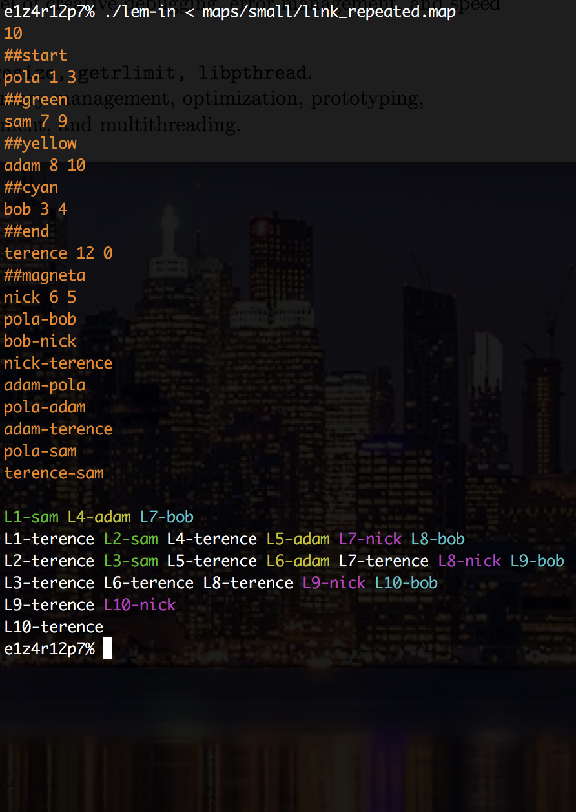
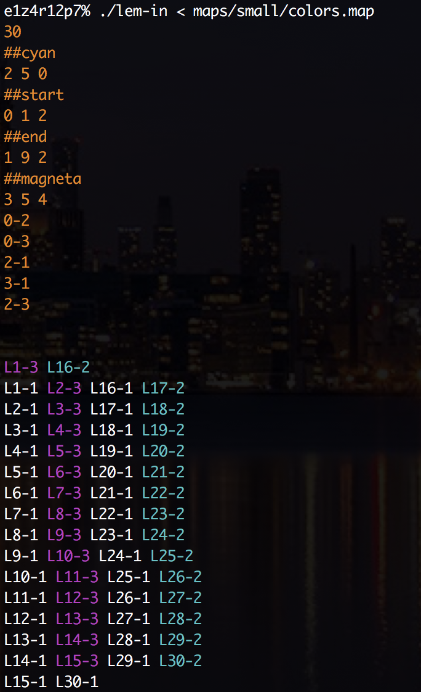
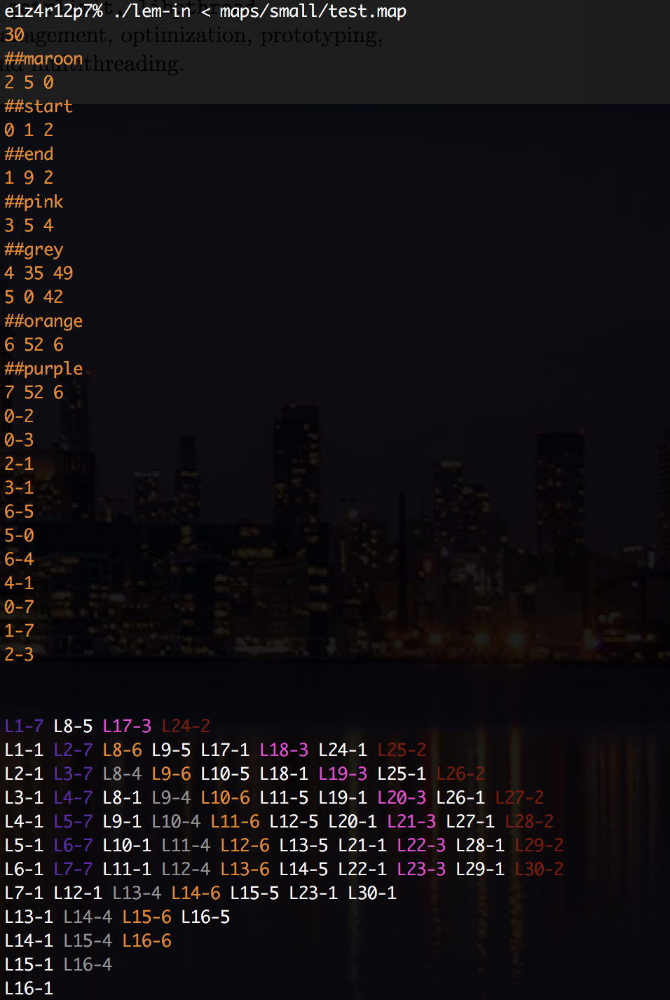

# Lem-in - the quickest way to get the 🐜🐜🐜 across the farm.

Implemented algorithm analyzes a unique input with a variable number of ants and helps the colony navigate from the start of a maze to the. The solver is multi-pathed, recursive, and weighted for distance. It doesn't forget about avoiding traffic jams  as well as walking all over their fellow ants. A graphical output to watch the ants find their home included! ✅ 
</br></br>

<p float="left">
   
   
  
</p>

## How to run lem-in?
```
git clone https://github.com/psprawka/Lem-in.git lem-in-psprawka
cd lem-in-psprawka
make
./lem-in < <map_example>
```
The exemplary maps are avaliable in ```maps/``` directory. Personally, I'll recommend ```maps/big/42_france.map```
</br>
The output will be displayed in following format:
```
number_of_ants
the_rooms
the_links
Lx-y Lz-w Lr-o ...
```
where:
* ```x```, ```z```, ```r``` represent the ants’ numbers (going from 1 to number_of_ants),
* ```y```, ```w```, ```o``` represent the rooms’ names.
</br></br>

## A farm rules
### There are some rules each given farm has to respect:
* all ants start in ```##start``` room,
* lines starting with ```##``` are commands modifying the line that comes right after,
* ```##start``` signals the ant farm’s entrance and ```##end``` its exit,
* ```#``` means comment till the end of the line,
* all unknown commands are ignored,
* non compliant or empty lines will stop the ant farm’s reading,
* each room can contain **only one** ant at a time (excluding ```##start``` and ```##end```).
</br></br>

## Create your own farm!
